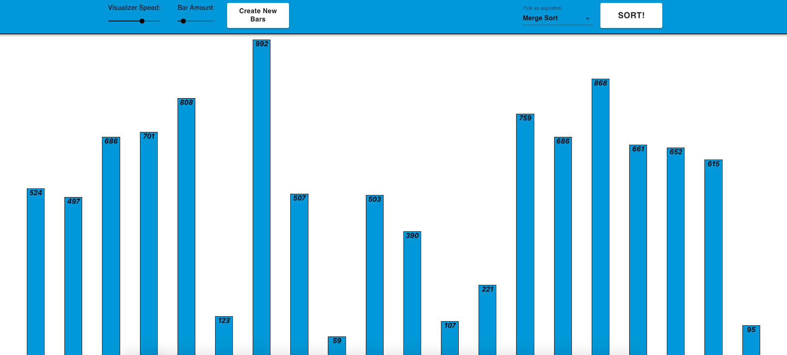
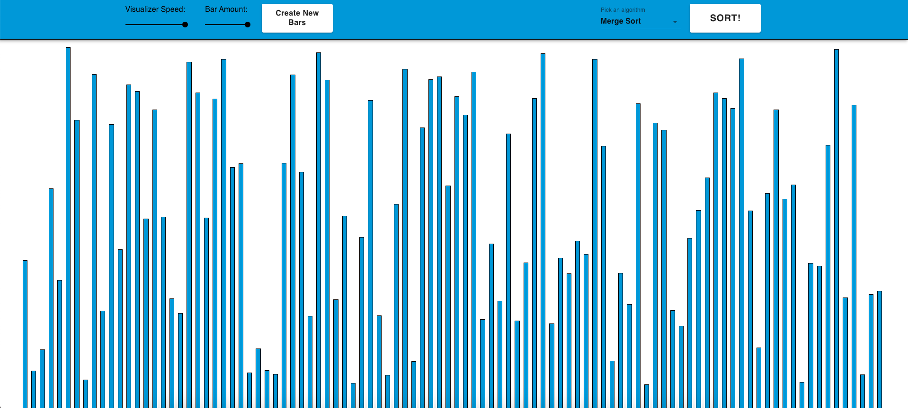
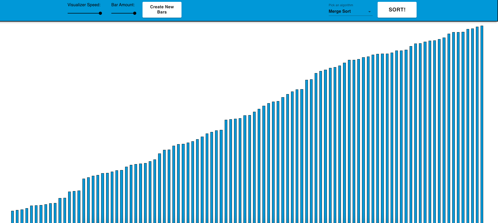

# Sorting Algorithms Visualiser

## <ins> Preview:</ins> 👀
Welcome to my Sorting Algorithms Visualiser!👋

I got inspired by [clément mihailescu](https://www.youtube.com/channel/UCaO6VoaYJv4kS-TQO_M-N_g). When I saw his project I immediately knew I'll create my own version one day.

You can view the effects of Comparison based sorting Algorithms on random and sorted integers arrays.
Each bar represents a number, height is accordingly.
The numbers that are compared are marked in yellow, and you can see the swaps occurring.

Personally, I'm fascinated by sorting algorithms and deeply enjoyed creating this project and enhanced my knowledge through it.

I hope that you'll enjoy playing around with this visualization tool just as much as I enjoyed building it, and maybe notice and learn something new from seeing the algorithms visualized. 💪💙

## <ins> How to use:
- Pick an algorithm
- Choose number of bars (==numbers in the array)
- Choose sorting speed (I recommend using the default speed configured and re running adapted if you wish)
- Click the sort button and watch how the algorithm works :)
- When the animation is done, you can run the algorithms again on a sorted array and watch how it behaves in this case, or you can create new bars and repeat the steps
- Enjoy 💙😊

## <ins> Interesting to notice:</ins> 🤔🧐
- The <b>divide and conquer</b> principle displayed in merge sort 
- When the quick sort is run on a sorted array - which is its worst-case scenario, the pivot choice of the last element is recursively the maximum and it's horribly ineffective.
- Stages of heap sort regardless if the heap is sorted or not (building a heap, extracting max and heapifying down)
- How ineffective and aggressive bubble sort is

## <ins> Running the project:</ins> 🏃‍♂️

### Preferably check the online demo:

[https://sortingalgosvis-eg.herokuapp.com/](https://sortingalgosvis-eg.herokuapp.com/)

- Preferably Google Chrome!

- Might take a couple of seconds for the initial load due to the free hosting service

### Otherwise:

1. Clone the repo
2. Run `npm install`
3. Run `npm run build`
4. Run `npm start`
5. Navigate in browser to `http://localhost:3001`

## <ins> Techstack:</ins> 🛠👨‍💻
- React 
- Node.js Express
- Material-UI

   

## <ins> Screenshots:</ins> 📸

### <ins>Unsorted:</ins>

### <ins>Mid Sort:</ins>

### <ins>Sorted:</ins>

